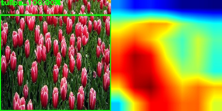
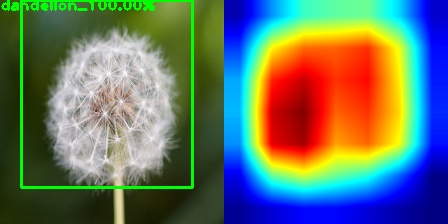
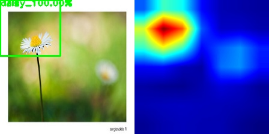
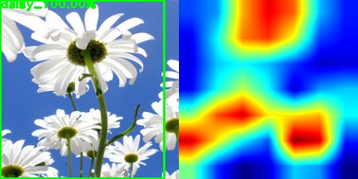

# Tensorflow_Learning_Deep_Features_for_Discriminative_Localization (VGG16)
- Weakly Supervised Learning !!

## Results (Test Samples)

## Device
- GTX 1050 (Test)

## Requirements
- Tensorflow 1.13.1
- OpenCV 4.0.0
- Numpy 1.16.4
